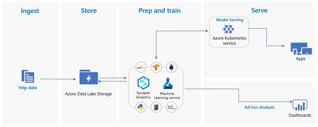

# Complete-EDA-and-Sentiment-Analysis  
  
In depth EDA, Sentiment Analysis Model Building Evaluation and Selection, Model deployment  

# INTRODUCTION 

Yelp is an American public company headquartered in San Francisco, California. The company develops, hosts, and markets the Yelp.com website and the Yelp mobile app, which publish crowd-sourced reviews about businesses. It also operates an online reservation service called Yelp Reservations (Yelp).  Yelp's website, Yelp.com, is a crowd-sourced local business review and social networking site. The site has pages devoted to individual locations, such as restaurants or schools, where Yelp users can submit a review of their products or services using a one-to-five-star rating system. Businesses can also update contact information, hours, and other basic listing information or add exclusive deals.   Yelp provides a subset of its data for use in personal, educational, and academic purposes. Rest of this paper discusses what can we do with the Yelp Open Datasets and how can that analysis be beneficial?  

# FOCUS AREA  
Yelp dataset is extraordinarily rich in nature and a lot of interesting data science and exploratory data analytics analysis can be done using it. In this paper, the following topics are addressed:  
•	Data Preparation (JSON to CSV and Parquet) in PySpark (Extraction, Transformation, Loading)  
•	In depth EDA across multiple facets of the Yelp Dataset  
•	Yelp review sentiment Analysis Model Building Evaluation and Selection  
•	Model deployment as scalable REST API  
•	Real life usage of the sentiment analysis model  

# VALUE PROPOSITION  
TOP 3 value proposition:  
•	In depth EDA for analyzing a business which is part of YELP network.  
•	Because of the enormous size of the text corpus used, the model exposed is generalized in nature and can be used to do sentiment scoring of businesses and products even outside of Yelp network.  
•	For a business, the Sentiment Analysis is particularly important. We will  give the business owners a curated list of top ten keywords impacting positive sentiment and top ten attributes impacting negative sentiment. This will give the restaurants a great stating point to work on improving aspects of their service which matters most thereby increasing customer satisfaction and eventually generating more revenue.  

# GUIDING PRINCIPLES
The work that will be subsequently done as part of this paper will have at the very least embody the following principles (ai/responsible-ai, n.d.):  
•	Fair - AI must maximize efficiencies without destroying dignity and guard against bias.  
•	Accountable - AI must have algorithmic accountability.  
•	Transparent - AI systems must be transparent and understandable.  
•	Ethical - AI must assist humanity and be designed for intelligent privacy.  

# Contents
| File/folder       | Description                                |
|-------------------|--------------------------------------------|
| `notebook`        | Python Notebooks.                          |
| `data`            | Yelp Dataset                        |
| `images`          | Sample images used for documentation.      |
| `.gitignore`      | Define what to ignore at commit time.      |
| `CHANGELOG.md`    | List of changes to the sample.             |
| `CONTRIBUTING.md` | Guidelines for contributing to the sample. |
| `README.md`       | This README file.                          |
| `LICENSE`         | The license for the sample.                |

# SOURCE DATASET  
For this project, the data is sourced from Yelp Open Datasets (dataset). The Yelp dataset is a subset of businesses, reviews, and user data for use in personal, educational, and academic purposes. Each data file is composed of a single object type, one JSON-object per-line.   
The data is downloaded and hosted in Azure Data Lake Storage Gen2 (/data-lake-storage) a massively scalable and secure data lake for your high-performance analytics workloads for all future analysis. We have also converted the data into CSV (and parquet for performance comparison) format from JSON for easier analysis and code readability.  

# PROCESS FLOW
Given below is the architecture that this solution will use.   
   

 
Synopsis: Raw data in JSON format is ingested into Azure Data lake store. From that point PySpark code is used for transformation (unnesting, schema tagging etc.) into parquet and csv format and stored back in Azure Data Lake Store. Further featurization and model building is done in Azure Machine Learning Platform using Python code + Azure Machine Learning APIs. After the best mode is selected, it is registered in Azure Container Registry and finally hosted in Azure Kubernetes Services for scoring new data points.

# REFERENCES
/data-lake-storage. (n.d.). Retrieved from azure.microsoft.com: https://azure.microsoft.com/en-us/services/storage/data-lake-storage/  
ai/responsible-ai. (n.d.). Retrieved from microsoft.com: https://www.microsoft.com/en-us/ai/responsible-ai  
concept-automated-ml. (n.d.). Retrieved from https://docs.microsoft.com/en-us/azure: https://docs.microsoft.com/en-us/azure/machine-learning/concept-automated-ml  
dataset. (n.d.). Retrieved from www.yelp.com: https://www.yelp.com/dataset  
key-features-of-data-lake-storage-gen2. (n.d.). Retrieved from docs.microsoft.com: https://docs.microsoft.com/en-us/azure/storage/blobs/data-lake-storage-introduction#key-features-of-data-lake-storage-gen2  
kubernetes-service. (n.d.). Retrieved from azure.microsoft.com: https://azure.microsoft.com/en-us/services/kubernetes-service/  
latest. (n.d.). Retrieved from spark.apache.org: https://spark.apache.org/docs/latest/index.html  
machine-learning. (n.d.). Retrieved from azure.microsoft.com: https://azure.microsoft.com/en-us/services/machine-learning/  
spark.apache.org. (n.d.). Retrieved from https://spark.apache.org/docs/latest/sql-programming-guide.html  
Yelp. (n.d.). Retrieved from en.wikipedia.org: https://en.wikipedia.org/wiki/Yelp  

